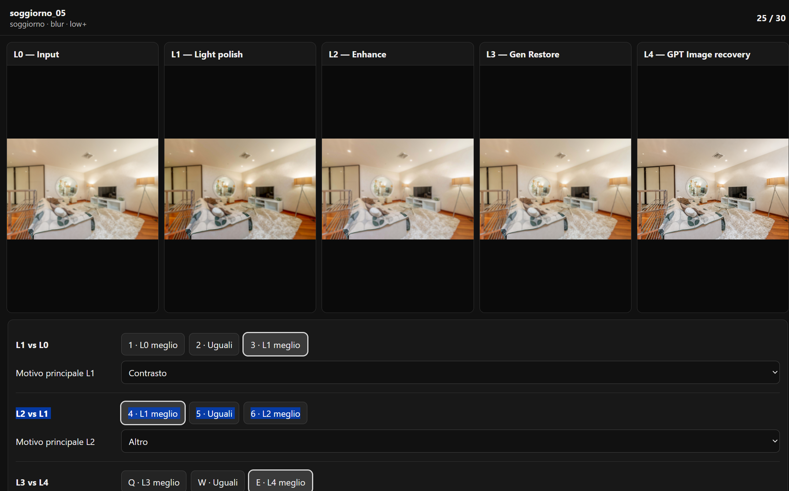
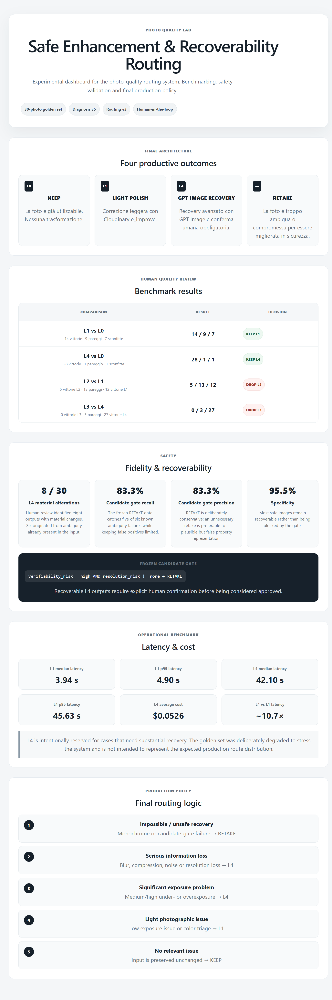
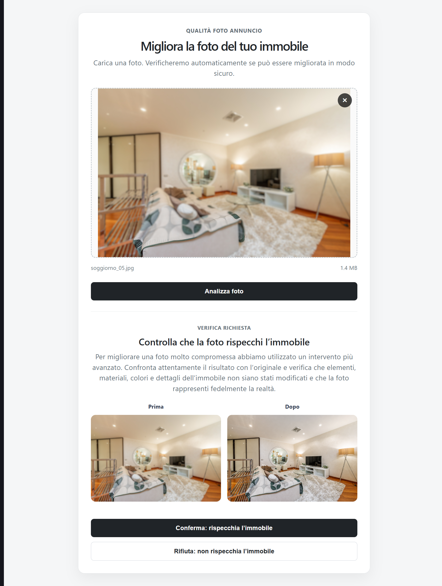
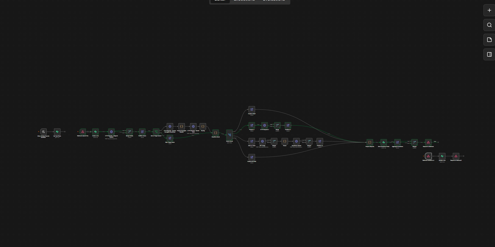

# Photo Quality Lab: Safe Enhancement / Recoverability Routing

Case study per la posizione **Product Builder, Agentic AI Products** · Immobiliare.it · settembre 2026

Prototipo end-to-end per valutare e migliorare fotografie immobiliari mantenendo come vincolo principale la fedeltà rispetto all'immobile reale.

Il sistema applica il livello minimo di intervento sufficiente. Quando l'immagine degradata non contiene abbastanza informazione verificabile per una recovery affidabile, richiede un nuovo scatto.

**Setup locale di sviluppo e demo.** n8n, il servizio di diagnosi e le due UI girano in locale; Supabase, Cloudinary, OpenAI e Gemini sono servizi cloud.

---

## Obiettivo

Il caso considera foto caricate da smartphone da privati o piccole agenzie, senza un fotografo professionista.

I problemi fotografici trattati includono:

* esposizione;
* dominante cromatica;
* blur;
* rumore;
* compressione;
* perdita di dettaglio;
* risoluzione insufficiente.

### Trattati parzialmente

Alcuni aspetti non vengono modificati direttamente dal sistema, ma sono stati trattati come vincoli di sicurezza e fedeltà:

* conservazione di oggetti e loro posizione;
* geometria della stanza e delle aperture;
* materiali, texture e finiture;
* difetti visibili dell'immobile;
* testo presente nella scena;
* vista esterna, framing e crop;
* attendibilità dei dettagli ricostruiti da L4.

Questi aspetti entrano nel progetto attraverso il prompt conservativo di L4, la review manuale di fedeltà, il benchmark del checker automatico, il recoverability gate e la conferma umana obbligatoria sugli output generativi.

Il sistema non può garantire automaticamente la correttezza semantica di ogni dettaglio. Per questo la decisione finale su L4 resta human-in-the-loop.

### Fuori perimetro

Non sono implementate trasformazioni intenzionali dell'immobile o della scena, tra cui:

* virtual staging;
* decluttering;
* redesign;
* aggiunta, rimozione o spostamento volontario di oggetti;
* sostituzione intenzionale di materiali o finiture;
* rimozione intenzionale di difetti reali dell'immobile.

---

## Scala sperimentale L0–L4

Il progetto è partito da cinque possibili livelli di intervento. Ogni foto del benchmark è stata processata con tutti i livelli.

| Livello | Implementazione                | Ruolo                                       |
| ------- | ------------------------------ | ------------------------------------------- |
| **L0**  | immagine invariata             | baseline                                    |
| **L1**  | Cloudinary `e_improve`         | light polish                                |
| **L2**  | Cloudinary `e_enhance`         | secondo candidato automatico di enhancement |
| **L3**  | Cloudinary `e_gen_restore`     | restoration generativa                      |
| **L4**  | OpenAI GPT Image 2, image edit | recovery generativa più forte               |

### L0

Nessuna trasformazione. Serve come baseline e diventa **KEEP** nel routing finale.

### L1

Correzione leggera tramite Cloudinary `e_improve`.

È pensata soprattutto per:

* piccoli problemi di esposizione;
* colore;
* white balance;
* miglioramento fotografico generale senza ricostruzione generativa.

### L2

Secondo candidato automatico basato su Cloudinary `e_enhance`.

È stato incluso nel benchmark per verificare se offrisse un vantaggio stabile rispetto a L1.

### L3

Restoration generativa tramite Cloudinary `e_gen_restore`.

È stato testato come livello intermedio tra enhancement automatico e recovery generativa L4.

### L4

Image edit con GPT Image 2.

Riceve l'immagine degradata e un prompt conservativo che permette interventi su:

* esposizione;
* white balance e color cast;
* contrasto;
* rumore;
* compressione;
* nitidezza recuperabile;
* qualità fotografica generale.

Il prompt chiede di preservare oggetti, geometria, materiali, texture, difetti, testo, vista, framing e crop.

L4 può recuperare immagini fortemente degradate, ma introduce un rischio specifico: quando l'input è ambiguo può ricostruire dettagli visivamente plausibili che non sono verificabili.

---

## Golden set e fan-out

Il benchmark usa **30 fotografie** distribuite su sei tipologie di ambiente:

* bagno;
* cucina;
* soggiorno;
* camera da letto;
* corridoio;
* stanze vuote.

Le degradazioni comprendono blur, compressione, rumore, esposizione e problemi di colore. La maggior parte delle degradazioni è sintetica e costruita per stressare il sistema.

Ogni foto è stata processata su tutti i livelli:

```text
30 immagini × 5 livelli = 150 esecuzioni
```

Sono stati mantenuti anche controlli `do no harm` su fotografie sane per verificare che l'enhancement non venisse applicato senza beneficio.

---

## Diagnosi e routing

La diagnosi è separata dal routing.

`diagnosis-service/app/main.py` misura caratteristiche dell'immagine e produce segnali strutturati. La scelta KEEP/L1/L4/RETAKE avviene successivamente in n8n.

```text
immagine
   ↓
segnali raw
   ↓
classificazione del difetto
   ↓
routing
```

La diagnosi considera:

* blur globale e locale;
* rumore;
* blocking JPEG;
* esposizione;
* risoluzione;
* colore;
* perdita quasi completa dell'informazione cromatica;
* rischio di verificabilità dell'input.

Dove possibile sono state usate metriche già descritte in letteratura. Alcuni cutoff restano invece scelte operative del prototipo, verificate sul golden set.

I segnali raw vengono salvati insieme alla classificazione.

### Un esempio: blur locale

La prima versione usava una misura globale di blur. In alcuni casi una zona nitida compensava parti significativamente sfocate dell'immagine.

`corridoio_04` era uno di questi casi.

È stata quindi aggiunta la stessa metrica su una griglia 4×4, escludendo le tessere quasi uniformi. Nel golden set finale:

```text
clean / non-blur: massimo osservato ≈ 38% tessere sfocate
blur sintetico:   minimo osservato ≈ 73%
corridoio_04:     ≈ 81%
```

Il dettaglio delle metriche, delle soglie e delle iterazioni è in:

[`docs/diagnosi_e_routing.md`](docs/diagnosi_e_routing.md)

---

## Review umana

Per valutare gli output è stata costruita durante lo sviluppo una **mini UI di review collegata a Supabase**.

La view `review_qualita_images` esponeva per ogni fotografia gli URL degli output L0–L4. La UI li mostrava nello stesso contesto e salvava i confronti nella reference strutturata.

La prima fase ha raccolto:

```text
L1 vs L0
L4 vs L0
```

Successivamente la UI è stata estesa per mostrare tutti gli output **L0–L4** e raccogliere:

```text
L2 vs L1
L3 vs L4
```

Sono stati scelti i confronti necessari alle decisioni di prodotto, evitando tutte le dieci combinazioni pairwise possibili tra cinque livelli.

La reference finale è una **single-reviewer structured benchmark review**.

La mini UI usata per costruire la reference è distinta dalla **Lab UI finale**, che presenta in forma statica i risultati congelati del benchmark.



---

## Risultati della selezione dei livelli

### L1 vs L0

| Risultato | Casi |
| --------- | ---: |
| L1 vince  |   14 |
| Pareggio  |    9 |
| L0 vince  |    7 |

Nel dominio previsto di luce, colore e white balance:

```text
9 vittorie L1
2 pareggi
0 sconfitte
```

L1 viene quindi mantenuto come light polish.

### L2 vs L1

```text
L2 vince: 5
Pareggi: 13
L1 vince: 12
```

Il vantaggio osservato nei pochi casi favorevoli a L2 era generalmente ridotto e non individuava un dominio abbastanza distinto da giustificare un ulteriore ramo produttivo.

**L2 viene escluso.**

### L3 vs L4

```text
L3 vince: 0
Pareggi: 3
L4 vince: 27
```

Sul golden set non emerge un caso in cui L3 sia preferibile a L4.

**L3 viene escluso.**

### L4 vs L0

```text
L4 vince: 28
Pareggio: 1
L0 vince: 1
```

Nei casi con blur e compressione:

```text
16/16 vittorie L4
```

L4 viene mantenuto come livello di recovery.



---

## Qualità e fedeltà

La qualità visiva da sola non è sufficiente per una fotografia immobiliare.

Tutti i 30 output L4 sono stati quindi sottoposti anche a review manuale di fedeltà.

Risultato:

```text
8/30 output L4 con alterazioni materiali
```

Le cause sono state classificate in:

```text
6 casi: ambiguità già presente nell'input
2 casi: alterazione diretta prodotta da L4
```

Il benchmark distingue quindi due domande:

1. l'immagine migliorata è fotograficamente migliore?
2. l'output rappresenta ancora in modo affidabile ciò che era verificabile nell'input?

L4 ottiene risultati molto forti sul primo punto. Il secondo richiede controlli aggiuntivi.

---

## Checker automatico di fedeltà

È stato testato un checker VLM per identificare automaticamente alterazioni materiali.

Il primo benchmark contro la reference umana ha prodotto:

```text
TP = 0
FN = 7
FP = 0
TN = 22
recall = 0%
```

Il checker non è quindi usato come hard gate nel prodotto finale.

La reference manuale resta il riferimento del benchmark di fedeltà.

---

## Recoverability

La fase successiva ha cercato di prevedere quando l'input contiene ancora abbastanza informazione verificabile per consentire una recovery L4.

Per calibrare il gate sono stati considerati:

```text
6 failure causate da input ambiguity
22 output L4 safe
```

I due casi di alterazione diretta prodotta da L4 sono stati esclusi da questa calibrazione: rappresentano un rischio diverso, che una misura della recoverability dell'input non può prevedere direttamente.

La diagnosi considera, tra gli altri segnali:

* blur;
* compressione;
* rumore;
* esposizione;
* risoluzione;
* `verifiability_risk`;
* `resolution_risk`.

La regola semplice risultata migliore sul benchmark è:

```text
verifiability_risk = high
AND resolution_risk != none
→ RETAKE
```

Risultato:

```text
TP = 5
FN = 1
FP = 1
TN = 21
```

| Metrica     | Valore |
| ----------- | -----: |
| Recall      |  83,3% |
| Precision   |  83,3% |
| Specificity |  95,5% |

Il falso negativo è `camera_da_letto_05`; il falso positivo è `corridoio_01`.

Non è stata aggiunta una regola ad hoc per correggere il singolo falso negativo.

Il gate resta quindi un **candidate recoverability gate derivato dal benchmark**, da validare su un dataset reale più ampio.

---

## Routing produttivo finale

La scala sperimentale L0–L4 viene ridotta a quattro esiti:

```text
KEEP / L0
L1
L4
RETAKE
```

`RETAKE` non è un sesto livello. È la decisione di non applicare enhancement quando la recovery richiederebbe una quantità eccessiva di ricostruzione non verificabile.

### KEEP

Foto già adeguata.

```text
output = input
human confirmation = false
```

### L1

Problema leggero di luce o colore.

```text
Cloudinary e_improve
human confirmation = false
```

### L4

Usato per:

* blur medio o alto;
* compressione seria o incerta;
* rumore alto;
* resolution risk alto;
* problemi significativi di esposizione.

Se il candidate recoverability gate segnala un rischio troppo alto, il router passa invece a RETAKE.

Ogni output L4 richiede conferma umana.

### RETAKE

La UI richiede un nuovo scatto e non produce un'immagine migliorata.

È usato anche quando l'input è sostanzialmente monocromatico:

```text
p95_saturation < 8
→ RETAKE
```



---

## Architettura finale

```text
Upload UI (React)
      │
      ├─ upload unsigned ───────────────▶ Cloudinary
      │
      ▼
POST /webhook/photo_quality
      │
      ▼
n8n
 ├─ crea record `foto`
 ├─ diagnosis-service
 ├─ prefiltro colore
 ├─ [se necessario] Gemini
 ├─ routing v3
 │    ├─ KEEP
 │    ├─ L1 → Cloudinary e_improve
 │    ├─ L4 → GPT Image 2 → Cloudinary
 │    └─ RETAKE
 ├─ salva `decisioni_finali`
 └─ risposta alla Upload UI

L4
 └─ confronto prima/dopo
      │
      ▼
 POST /webhook/confirm_l4
      │
      ├─ confirmed
      └─ rejected
```



Dettagli dei componenti e dei contratti:

[`docs/architettura.md`](docs/architettura.md)

---

## Benchmark operativo

| Cosa                | Risultato                     |
| ------------------- | ----------------------------- |
| L1, n = 10          | mediana 3,94 s · p95 4,90 s   |
| L4, n = 10          | mediana 42,10 s · p95 45,63 s |
| Costo L4            | ≈ $0,0526 / immagine          |
| Rapporto di latenza | L4 ≈ 10,7× L1                 |

Il golden set contiene volutamente molte immagini degradate. La distribuzione dei route osservata nel benchmark non rappresenta quella attesa in produzione, dove è ragionevole aspettarsi una quota maggiore di KEEP e L1.

Metodo e risultati completi:

[`docs/benchmark.md`](docs/benchmark.md)

---

## Persistenza

Supabase salva:

* fotografie e metadati del golden set;
* esecuzioni L0–L4, output, latenza e costo;
* metriche fotografiche;
* reference umane di qualità e fedeltà;
* risultati dei checker;
* diagnosi degli input;
* decisioni finali e conferme L4.

Il DDL completo è disponibile in:

[`db/schema.sql`](db/schema.sql)

---

## Struttura del repository

```text
├─ README.md
├─ docs/
│  ├─ assets/
│  │  ├─ upload_ui_example.png
│  │  ├─ ui_lab.png
│  │  ├─ pic_comparation_ui_example.png
│  │  └─ PI_n8n_full_workflow_canvas.png
│  ├─ nota_di_accompagnamento.md
│  ├─ architettura.md
│  ├─ benchmark.md
│  └─ diagnosi_e_routing.md
├─ n8n/
│  ├─ README.md
│  └─ photo_quality_workflow.json
├─ db/
│  └─ schema.sql
├─ diagnosis-service/
├─ upload-ui/
├─ lab-ui/
└─ .gitignore
```

---

## Avvio locale

### Requisiti

* Docker Desktop;
* Node.js e npm;
* container n8n già configurato;
* credenziali per Cloudinary, Supabase, OpenAI e Gemini;
* workflow importato da `n8n/`.

Ordine di avvio:

```text
Docker Desktop
→ n8n
→ diagnosis-service
→ upload-ui
→ lab-ui
```

### n8n

```powershell
docker start n8n
```

UI:

```text
http://localhost:5678
```

Endpoint:

```text
POST http://localhost:5678/webhook/photo_quality
POST http://localhost:5678/webhook/confirm_l4
```

Configurazione del workflow:

[`n8n/README.md`](n8n/README.md)

### diagnosis-service

Dalla root del repository:

```powershell
docker build -t diagnosis-service ./diagnosis-service
docker run --rm -p 8000:8000 --name diagnosis-service diagnosis-service
```

Servizio:

```text
http://localhost:8000
```

Swagger:

```text
http://localhost:8000/docs
```

Da n8n il servizio viene raggiunto tramite:

```text
http://host.docker.internal:8000/diagnosi
```

### Upload UI

```powershell
cd upload-ui
npm install
npm run dev
```

UI:

```text
http://localhost:5173
```

### Lab UI

```powershell
cd lab-ui
npm install
npm run dev -- --port 5174
```

UI:

```text
http://localhost:5174
```

La Upload UI contiene il `cloud_name`, il nome del preset unsigned Cloudinary e gli URL dei webhook locali. Questi valori non sono segreti.

Le API key e le altre credenziali restano nell'istanza n8n e non sono incluse nel repository.

---

## Reale e simulato

### Implementato e testato

* golden set e degradazioni;
* fan-out L0–L4 e 150 esecuzioni;
* diagnosi fotografica;
* mini UI di review;
* reference umana di qualità e fedeltà;
* benchmark del checker automatico;
* analisi e candidate gate di recoverability;
* routing finale;
* workflow n8n;
* integrazioni Cloudinary, GPT Image, Gemini e Supabase;
* Upload UI e Lab UI;
* conferma e rifiuto degli output L4;
* benchmark di costo e latenza.

### Simulato o limitato al prototipo

* integrazione con l'upload nativo di Immobiliare.it, sostituita da un form;
* degradazioni prevalentemente sintetiche;
* review a singolo valutatore;
* esecuzione locale;
* testi UI senza revisione legale;
* nessuna misura di impatto business su traffico o conversione.

---

## Limiti

* Golden set di 30 fotografie.
* Degradazioni prevalentemente sintetiche.
* Review umana a singolo valutatore.
* Alcuni cutoff diagnostici sono scelte operative del prototipo e richiedono validazione su fotografie reali più numerose.
* Candidate gate derivato dallo stesso benchmark su cui è stato valutato.
* Diagnosi ancora debole nella distinzione tra defocus recuperabile e motion blur distruttivo.
* Le metriche globali possono perdere ambiguità semantiche locali.
* L4 richiede conferma umana per gestire il rischio residuo.
* Gli asset Cloudinary con delivery `upload` sono accessibili a chi conosce l'URL; un deployment reale richiederebbe hardening e delivery firmata o autenticata.

Ulteriori dettagli:

[`docs/nota_di_accompagnamento.md`](docs/nota_di_accompagnamento.md)

---

## Sviluppi successivi

Le priorità principali sono:

* dataset più ampio con degradazioni reali;
* review multi-rater;
* calibrazione indipendente del recoverability gate;
* detector più affidabile per distinguere motion blur e defocus;
* hardening dell'upload e della delivery degli asset;
* confronto tra configurazioni L4 con costo e qualità differenti.

Il prototipo usa attualmente GPT Image 2 con:

```text
quality = medium
size = auto
output = PNG
```

Un benchmark successivo potrebbe verificare se alcune recovery più semplici possono usare configurazioni meno costose, misurando qualità, fedeltà, costo e latenza.

---

## Versioni di riferimento

| Componente           | Versione / regola                                                |
| -------------------- | ---------------------------------------------------------------- |
| Diagnosi             | `v5_tile_blur_2026-09-08`                                        |
| Routing              | `v3_2026-09-08`                                                  |
| Livelli sperimentali | L0 · L1 · L2 · L3 · L4                                           |
| Esiti produttivi     | KEEP/L0 · L1 · L4 · RETAKE                                       |
| Regola monocromatica | `p95_saturation < 8 → RETAKE`                                    |
| Candidate gate       | `verifiability_risk = high AND resolution_risk != none → RETAKE` |
| L4                   | conferma umana obbligatoria                                      |
| Modello L4           | `gpt-image-2-2026-04-21`                                         |
| Configurazione L4    | `quality=medium`, `size=auto`, PNG                               |

Ogni decisione finale salva `diagnosis_version` e `routing_version`, così i risultati restano associati alla logica che li ha prodotti.
